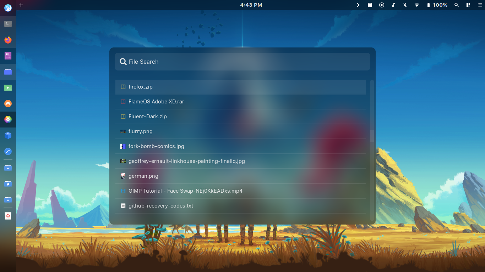
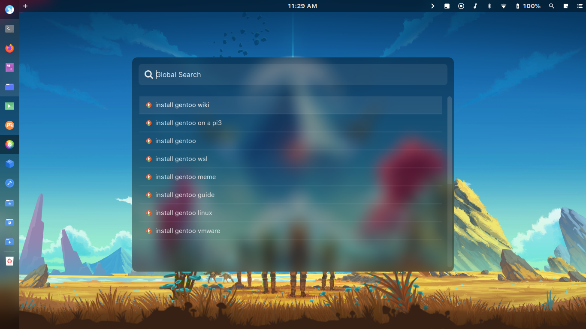

A Spotlight-like rofi. Supports file and web search. 

| File Browsing | Context Menu |
| --- | --- |
|  |  |

| Google Results | DuckDuckGo Results
| --- | --- |
|  |  |

This rofi will supposed to replace the web search in my awesome-wm setups.

#### Dependencies
+ `rofi-git master branch`
+ `python3`
+ `bash`
+ `an icon theme (optional)`

#### Icon themes used:
+ Papirus
+ Tela Blue

#### Run it by:

```bash
$ rofi -modi "Global Search":"rofi-spotlight/rofi-spotlight.sh" -show "Global Search" \
-config rofi-spotlight/rofi.rasi
```

#### Configuration:
You can change the following variables in the `rofi-spotlight.sh`
+ Terminal Emulator
+ File Manager
+ Bluetooth sender

You can change the following variables in the `web-search.py`
+ Search engine
+ Web browser
+ Terminal Emulator

#### Available commands:

Just type them on rofi search bar:

+ **`:help`** to print the help message  
+ **`:h`** or **`:hidden`** to show hidden files/directories  
+ **`:xdg XDGDIR`** to jump to an xdg directory  

Examples:

```
:xdg DOCUMENTS
:xdg DOWNLOADS

# Also supports incomplete path. Examples:

:xdg doc 	# Same as :xdg DOCUMENTS
:xdg down 	# Same as :xdg DOWNLOADS

# For more info about XDG dirs, see:
# man xdg-user-dir
```

**File search syntaxes:**
+ **`!<search_query>`** to search for a file and web suggestions  
+ **`?<search_query>`** to search parent directories  

Examples:

```
!half-life 3
?portal 3
```

**Web search syntaxes:**

+ **`!<search_query>`** to get a search suggestions  
+ **`:web <search_query>`** to also to gets search suggestions  
+ **`:webbro <search_query>`** to search directly from your browser  

Examples:

```
!how to install archlinux
:web how to install gentoo
:webbro how to install wine in windowsxp
```

#### TODOs:
- [x] Web search support
- [ ] Cleaner bash script

#### Notes:

+ This is not a file manager and web a browser. This is meant to be a file/web-searching rofi. Nothing else.
+ I'm fairly new on scripting something like this big, so pardon me if my code is kinda ugly, boilerplate and obscure. I will improve this from time to time, for sure.
+ Better with blur. Rofi's appearance can be change in `rofi.rasi`. It uses CSS syntax. More info by executing `man rofi-theme` in your terminal emulator.
